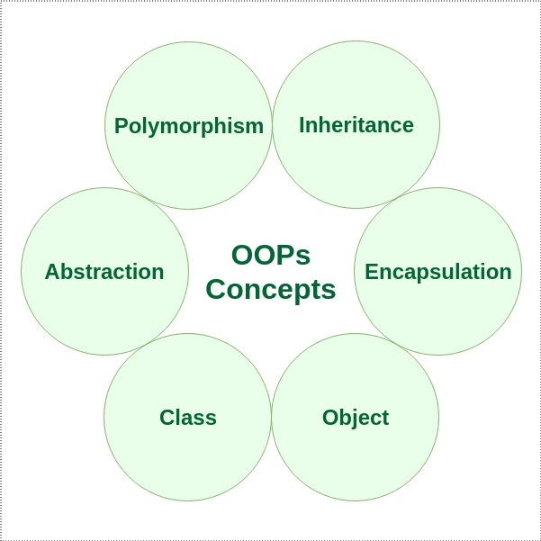

# Java-OOPs
OOPS stands for Object-Oriented Programming System. It is a programming approach that organizes code into objects and classes and makes it more structured and easy to manage. A class is a blueprint that defines properties and behaviors, while an object is an instance of a class representing real-world entities.

A PIE

1.Abstraction

In Java, abstraction is achieved by interfaces and abstract classes. We can achieve 100% abstraction using interfaces.

Abstract Classes and Abstract Methods
An abstract class is a class that is declared with an abstract keyword.
An abstract method is a method that is declared without implementation.
An abstract class may have both abstract methods (methods without implementation) and concrete methods (methods with implementation).
An abstract method must always be redefined in the subclass, thus making overriding compulsory or making the subclass itself abstract.
Any class that contains one or more abstract methods must also be declared with an abstract keyword.
There can be no object of an abstract class. That is, an abstract class can not be directly instantiated with the new operator.
An abstract class can have parameterized constructors and the default constructor is always present in an abstract class.
Algorithm to Implement Abstraction
Determine the classes or interfaces that will be part of the abstraction.
Create an abstract class or interface that defines the common behaviors and properties of these classes.
Define abstract methods within the abstract class or interface that do not have any implementation details.
Implement concrete classes that extend the abstract class or implement the interface.
Override the abstract methods in the concrete classes to provide their specific implementations.
Use the concrete classes to contain the program logic.

Java Interface

Key Properties of Interface:

The interface in Java is a mechanism to achieve abstraction.
By default, variables in an interface are public, static, and final.
It is used to achieve abstraction and multiple inheritance in Java.
It supports loose coupling (classes depend on behavior, not implementation).
In other words, interfaces primarily define methods that other classes must implement.
An interface in Java defines a set of behaviours that a class can implement, usually representing an IS-A relationship, but not always in every scenario.

2. Encapsulation
It is defined as the wrapping up of data under a single unit. It is the mechanism that binds together the code and the data it manipulates. Another way to think about encapsulation is that it is a protective shield that prevents the data from being accessed by the code outside this shield. 

Technically, in encapsulation, the variables or the data in a class is hidden from any other class and can be accessed only through any member function of the class in which they are declared.
Encapsulation can be achieved by declaring all the variables in a class as private and writing public methods in the class to set and get the values of the variables.